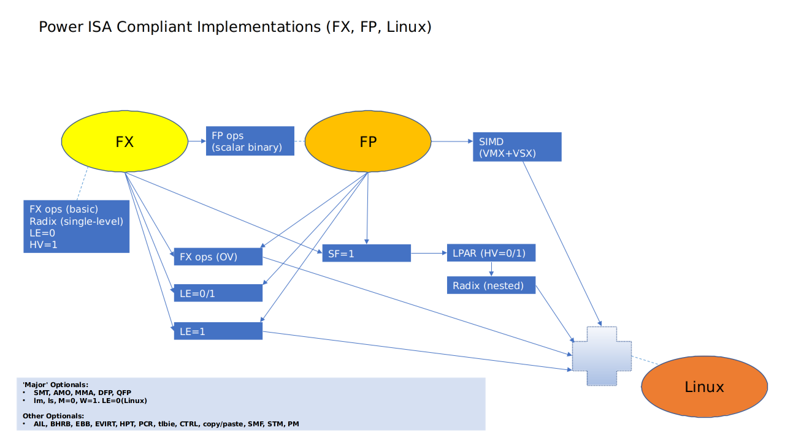
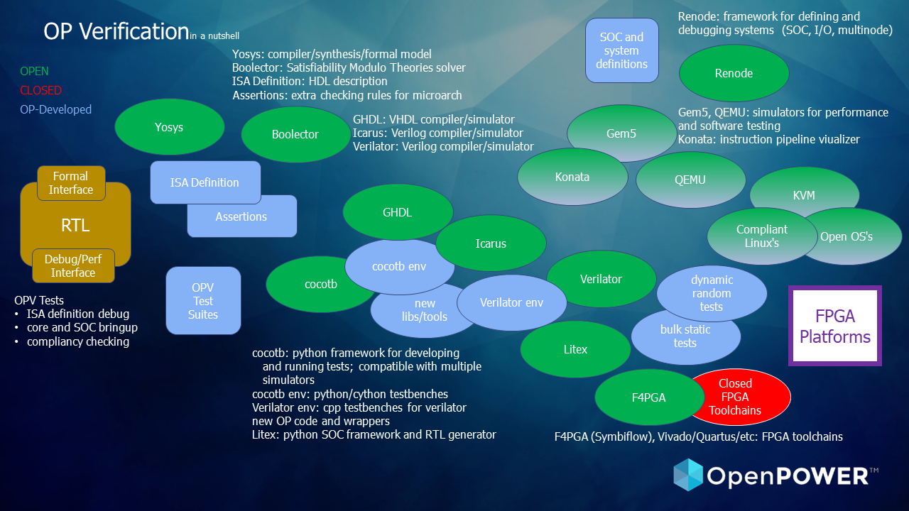

# Searchboat

***Drag the waters some more***

 
## OpenPower Formal and Functional Verification Tools and Environment

* define methodologies using opensource tools for building cores, components, and systems
* create new solutions to enhance methodology
* containerize

### ISA Specification

* create machine-readable ISA definition
* include metadata identifying features, compliancy levels, etc.

### Formal (Core)

* create PFVI (Power Formal Verification Interface) as common core test interface
* create formal environment for core vs. ISA testing

### Functional

* augment opensource tools with base libraries for common verification environment
* define test format, methodology, suites for core and above verification
* create new functional test methodologies

### Compliancy Testing

* create methodology, test suites, etc. for verifying cores vs. compliancy levels

### System

* define FPGA, SOC, etc. debug and test methodologies
* develop core- and system-specific software versions as needed (debuggers, compilers, kernels, etc.)

## Partial Landscape Overview

